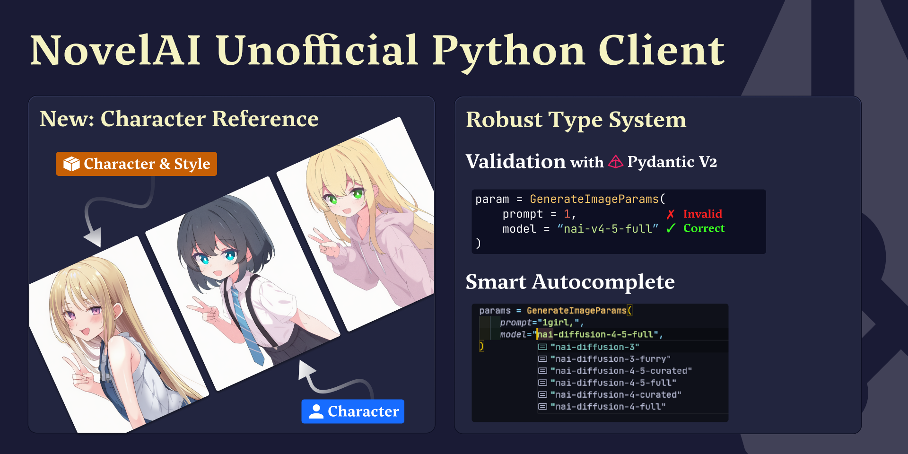
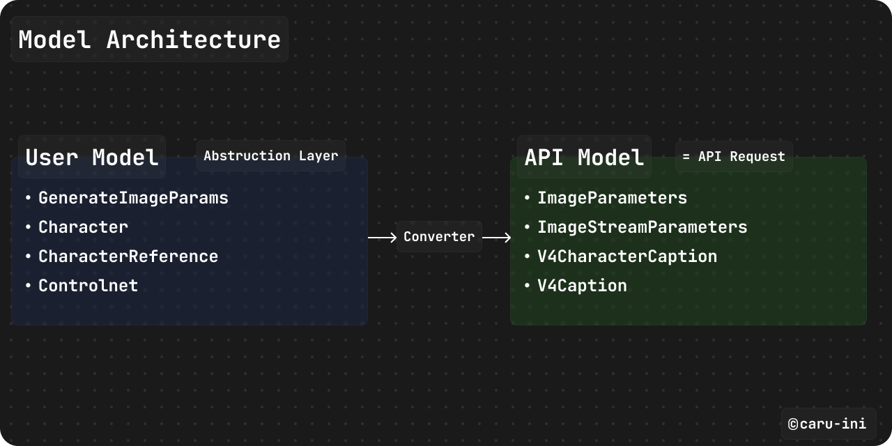

# NovelAI Python SDK



[](https://pypi.org/project/novelai-sdk/)
[](https://pypi.org/project/novelai-sdk/)
[](../LICENSE)
[](https://github.com/astral-sh/ruff)

[English](/README.md) | 日本語

NovelAIの画像生成APIのための、モダンで型安全なPython SDKです。Pydantic v2による堅牢なバリデーションと完全な型ヒントを備えています。

## 特徴

- Python 3.10+対応、完全な型ヒントとPydantic v2バリデーション
- 自動バリデーション機能を備えた高レベルな便利API
- 簡単な画像操作のためのPIL/Pillow組み込みサポート
- リアルタイム進捗監視のためのSSEストリーミング
- 精密参照（キャラクター参照）、ControlNet、マルチキャラクターポジショニング

## 他ライブラリとの比較

| 機能                         | novelai-sdk | [novelai-api](https://github.com/Aedial/novelai-api) | [novelai-python](https://github.com/LlmKira/novelai-python) |
| ---------------------------- | :---------: | :--------------------------------------------------: | :---------------------------------------------------------: |
| 型安全性（Pydantic v2）      |      ✅      |                          ❌                           |                              ✅                              |
| 非同期サポート               |      ✅      |                          ✅                           |                              ✅                              |
| 画像生成                     |      ✅      |                          ✅                           |                              ✅                              |
| テキスト生成                 |      🚧      |                          ✅                           |                              ✅                              |
| **精密参照(キャラクター参照)** |      ✅      |                          ❌                           |                              ❌                              |
| **マルチキャラクター配置**   |      ✅      |                          ❌                           |                              ✅                              |
| ControlNet / Vibe Transfer   |      ✅      |                          ❌                           |                              ✅                              |
| SSEストリーミング            |      ✅      |                          ❌                           |                              ✅                              |
| Python 3.10+                 |      ✅      |                          ❌                           |                              ❌                              |
| アクティブメンテナンス       |      ✅      |                          ✅                           |                              ⚠️                              |

✅ サポート | ❌ 未サポート | 🚧 予定 | ⚠️ 限定的メンテナンス

## ドキュメント

詳細なガイドと高度な使い方については、[ドキュメントサイト](https://caru-ini.github.io/novelai-sdk/)をご覧ください。

## クイックスタート

### インストール

```bash
# pipを使用
pip install novelai-sdk

# uv を使用(推奨)
uv add novelai-sdk
```

### 基本的な使い方

```python
from novelai import NovelAI
from novelai.types import GenerateImageParams

# クライアントの初期化(APIキーはNOVELAI_API_KEY環境変数から取得)
client = NovelAI()

# 画像を生成
params = GenerateImageParams(
    prompt="1girl, cat ears, masterpiece, best quality",
    model="nai-diffusion-4-5-full",
    size="portrait",  # または (832, 1216)
    steps=23,
    scale=5.0,
)

images = client.image.generate(params)
images[0].save("output.png")
```

### CLIの使い方

```bash
# 基本生成
python -m novelai "1girl, cat ears, maid" -o output.png

# 対話モード
python -m novelai --interactive --model nai-diffusion-4-5-full

# リクエストJSONから生成（高レベルparams）
python -m novelai --request-json examples/request_user.json -o output

# リクエストJSONをstdinから生成
cat examples/request_user.json | python -m novelai --request-json-stdin -o output
```

### 認証

環境変数または直接初期化でNovelAI APIキーを提供します:

```python
# .envファイルを使用(推奨)
from dotenv import load_dotenv
load_dotenv()
client = NovelAI()

# 環境変数
import os
os.environ["NOVELAI_API_KEY"] = "your_api_key_here"
client = NovelAI()

# 直接初期化
client = NovelAI(api_key="your_api_key_here")
```

### データモデル・アーキテクチャ

このライブラリは、2つの異なるデータモデル層で設計されています：



1. **User Model（推奨）**: 適切なデフォルト値と自動バリデーションを備えた、ユーザーフレンドリーなモデル。
2. **API Model**: NovelAIのAPIエンドポイントと1対1で対応する、主に内部で使用されるモデル。

#### 高レベルAPI

```python
from novelai import NovelAI
from novelai.types import GenerateImageParams

client = NovelAI()
params = GenerateImageParams(
    prompt="a beautiful landscape",
    model="nai-diffusion-4-5-full",
    size="landscape",
    quality=True,
)
images = client.image.generate(params)
```

## 高度な機能

### キャラクターリファレンス

リファレンス画像で一貫したキャラクターの外観を維持:

```python
from novelai.types import CharacterReference

character_references = [
    CharacterReference(
        image="reference.png",
        type="character",
        fidelity=0.75,
    )
]

params = GenerateImageParams(
    prompt="1girl, standing",
    model="nai-diffusion-4-5-full",
    character_references=character_references,
)
```

### マルチキャラクターポジショニング

個別のプロンプトで複数のキャラクターを個別に配置:

```python
from novelai.types import Character

characters = [
    Character(
        prompt="1girl, red hair, blue eyes",
        enabled=True,
        position=(0.2, 0.5),
    ),
    Character(
        prompt="1boy, black hair, green eyes",
        enabled=True,
        position=(0.8, 0.5),
    ),
]

params = GenerateImageParams(
    prompt="two people standing",
    model="nai-diffusion-4-5-full",
    characters=characters,
)
```

### ControlNet（Vibe Transfer）

リファレンス画像で構図やポーズを制御:

```python
from novelai.types import ControlNet, ControlNetImage, GenerateImageParams

controlnet_image = ControlNetImage(image="pose_reference.png", strength=0.6)
controlnet = ControlNet(images=[controlnet_image])

params = GenerateImageParams(
    prompt="1girl, standing",
    model="nai-diffusion-4-5-full",
    controlnet=controlnet,
)
```

### ストリーミング生成

生成の進捗をリアルタイムで監視:

```python
from novelai.types import GenerateImageStreamParams
from base64 import b64decode

params = GenerateImageStreamParams(
    prompt="1girl, standing",
    model="nai-diffusion-4-5-full",
    stream="sse",
)

for chunk in client.image.generate_stream(params):
    image_data = b64decode(chunk.image)
    print(f"Received {len(image_data)} bytes")
```

### Image-to-Image

テキストプロンプトで既存の画像を変換:

```python
from novelai.types import GenerateImageParams, I2iParams

i2i_params = I2iParams(
    image="input.png",
    strength=0.5,  # 0.0-1.0
    noise=0.0,
)

params = GenerateImageParams(
    prompt="cyberpunk style",
    model="nai-diffusion-4-5-full",
    i2i=i2i_params,
)
```

### バッチ生成

複数のバリエーションを効率的に生成:

```python
params = GenerateImageParams(
    prompt="1girl, various poses",
    model="nai-diffusion-4-5-full",
    n_samples=4,
)

images = client.image.generate(params)
for i, img in enumerate(images):
    img.save(f"output_{i}.png")
```

### Anlas消費量の見積もり

生成前に Anlas 消費量を見積もれます:

```python
from novelai.types import GenerateImageParams

params = GenerateImageParams(
    prompt="1girl, night city",
    model="nai-diffusion-4-5-full",
    size=(1024, 1024),
    steps=28,
)

estimate = params.calculate_anlas(is_opus=True)
print(estimate.total_anlas)
```

`calculate_anlas()` は現在の WebUI と公式ドキュメントをもとにした
best-effort な推定値です。プレビュー用途には使えますが、課金額を 100%
保証するものではありません。

## サンプル

実用的な使用例については、[サンプルドキュメント](https://caru-ini.github.io/novelai-sdk/examples/)または[`examples/`](../examples/)ディレクトリをご覧ください。

## ロードマップ

- [x] 非同期サポート
- [x] FastAPI統合サンプル
- [ ] Vibe transferファイルサポート（`.naiv4vibe`、`.naiv4vibebundle`）
- [x] Anlas消費量計算機
- [ ] 画像メタデータ抽出
- [ ] テキスト生成APIサポート

## 開発

### セットアップ

```bash
git clone https://github.com/caru-ini/novelai-sdk.git
cd novelai-sdk
uv sync
```

### コード品質

```bash
# コードのフォーマット
uv run poe fmt

# コードのリント
uv run poe lint

# 型チェック
uv run poe check

# poeをグローバルにインストールして簡単にアクセス
uv tool install poe

# コミット前にすべてのチェックを実行
uv run poe pre-commit
```

### テスト

テストは将来のリリースで追加される予定です。

## 必要要件

- Python 3.10+
- httpx (HTTPクライアント)
- Pillow (画像処理)
- Pydantic v2 (バリデーションと型安全性)
- python-dotenv (環境変数)
- rich (CLI出力レンダリング)

## 貢献

貢献を歓迎します。大きな変更の場合は、まずissueを開いてください。

詳細については、[貢献ガイド](CONTRIBUTING_jp.md)をご覧ください。開発環境のセットアップ、コード品質チェック、プルリクエストの手順などが記載されています。

```plaintext
{feat|fix|docs|style|refactor|test|chore}: 短い説明(英語で)
```

1. リポジトリをフォーク
2. フィーチャーブランチを作成 (`git checkout -b feature/AmazingFeature`)
3. コード品質チェックを実行 (`uv run poe pre-commit`)
4. 変更をコミット (`git commit -m 'Add some AmazingFeature'`)
5. ブランチにプッシュ (`git push origin feature/AmazingFeature`)
6. プルリクエストを開く

## ライセンス

MITライセンス。詳細はLICENSEファイルを参照してください。

## リンク

- [NovelAI公式ウェブサイト](https://novelai.net/)
- [NovelAIドキュメント](https://docs.novelai.net/)
- [Issue](https://github.com/caru-ini/novelai-sdk/issues)

## 免責事項

これは非公式のクライアントライブラリです。NovelAIとは提携していません。有効なNovelAIサブスクリプションが必要です。

## 謝辞

NovelAIチームとすべての貢献者に感謝します。
