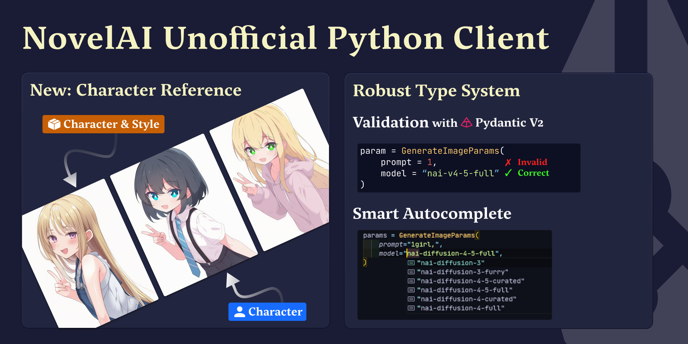
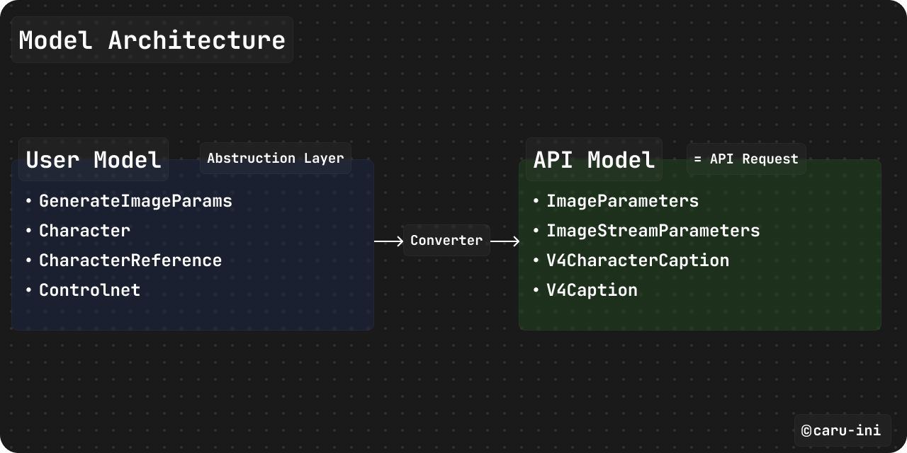

# NovelAI Python SDK



[](https://pypi.org/project/novelai-sdk/)
[](https://pypi.org/project/novelai-sdk/)
[](../LICENSE)
[](https://github.com/astral-sh/ruff)

[English](../README.md) | [日本語](./README_jp.md) | 简体中文

NovelAI 图像生成 API 的现代、类型安全的 Python SDK。具有使用 Pydantic v2 进行的强大验证和完整的类型提示。

支持的图像模型包括 `nai-diffusion-5-full`、`nai-diffusion-5-curated`、
`nai-diffusion-4-5-full` 和 `nai-diffusion-4-5-curated`。

## 特性

- 支持 Python 3.10+，具有完整的类型提示和 Pydantic v2 验证
- 高级便捷 API，自动验证
- 内置 PIL/Pillow 支持，便于图像操作
- SSE 流式传输，用于实时进度监控
- 精准参考（角色参考）、ControlNet 和多角色定位

## 与替代方案的比较

| 特性                            | novelai-sdk | [novelai-api](https://github.com/Aedial/novelai-api) | [novelai-python](https://github.com/LlmKira/novelai-python) |
| ------------------------------- | :---------: | :--------------------------------------------------: | :---------------------------------------------------------: |
| 类型安全 (Pydantic v2)          |      ✅      |                          ❌                           |                              ✅                              |
| 异步支持                        |      ✅      |                          ✅                           |                              ✅                              |
| 图像生成                        |      ✅      |                          ✅                           |                              ✅                              |
| 文本生成                        |      🚧      |                          ✅                           |                              ✅                              |
| **精准参考（角色参考）**        |      ✅      |                          ❌                           |                              ❌                              |
| **多角色定位**                  |      ✅      |                          ❌                           |                              ✅                              |
| ControlNet / Vibe Transfer      |      ✅      |                          ❌                           |                              ✅                              |
| SSE 流式传输                    |      ✅      |                          ❌                           |                              ✅                              |
| Python 3.10+                    |      ✅      |                          ❌                           |                              ❌                              |
| 积极维护                        |      ✅      |                          ✅                           |                              ⚠️                              |

✅ 支持 | ❌ 不支持 | 🚧 计划中 | ⚠️ 维护有限

## 文档

有关详细指南和高级用法，请访问我们的[文档网站](https://caru-ini.github.io/novelai-sdk/)。

## 快速开始

### 安装

```bash
# 使用 pip
pip install novelai-sdk

# 使用 uv (推荐)
uv add novelai-sdk
```

### 基本用法

```python
from novelai import NovelAI
from novelai.types import GenerateImageParams

# 初始化客户端 (API 密钥来自 NOVELAI_API_KEY 环境变量)
client = NovelAI()

# 生成图像
params = GenerateImageParams(
    prompt="1girl, cat ears, masterpiece, best quality",
    model="nai-diffusion-4-5-full",
    size="portrait",  # 或 (832, 1216)
    steps=23,
    scale=5.0,
)

images = client.image.generate(params)
images[0].save("output.png")
```

### CLI 用法

```bash
# 基本生成
python -m novelai "1girl, cat ears, maid" -o output.png

# 交互模式
python -m novelai --interactive --model nai-diffusion-4-5-full

# 从请求 JSON 生成（高级 params）
python -m novelai --request-json examples/request_user.json -o output

# 从 stdin 读取请求 JSON 生成
cat examples/request_user.json | python -m novelai --request-json-stdin -o output
```

## 认证

通过环境变量或直接初始化提供您的 NovelAI API 密钥：

```python
# 使用 .env 文件 (推荐)
from dotenv import load_dotenv
load_dotenv()
client = NovelAI()

# 环境变量
import os
os.environ["NOVELAI_API_KEY"] = "your_api_key_here"
client = NovelAI()

# 直接初始化
client = NovelAI(api_key="your_api_key_here")
```

### 数据模型架构

该库设计有两层不同的数据模型：



1. **用户模型 (推荐)**: 具有合理默认值和自动验证的用户友好模型。
2. **API 模型**: 直接 1:1 映射到 NovelAI 的 API 端点，主要用于内部。

#### 高级 API

```python
from novelai import NovelAI
from novelai.types import GenerateImageParams

client = NovelAI()
params = GenerateImageParams(
    prompt="a beautiful landscape",
    model="nai-diffusion-4-5-full",
    size="landscape",
    quality=True,
)
images = client.image.generate(params)
```

## 高级功能

### 角色参考

使用参考图像保持一致的角色外观：

```python
from novelai.types import CharacterReference

character_references = [
    CharacterReference(
        image="reference.png",
        type="character",
        fidelity=0.75,
    )
]

params = GenerateImageParams(
    prompt="1girl, standing",
    model="nai-diffusion-4-5-full",
    character_references=character_references,
)
```

### 多角色定位

使用单独的提示词分别定位多个角色：

```python
from novelai.types import Character

characters = [
    Character(
        prompt="1girl, red hair, blue eyes",
        enabled=True,
        position=(0.2, 0.5),
    ),
    Character(
        prompt="1boy, black hair, green eyes",
        enabled=True,
        position=(0.8, 0.5),
    ),
]

params = GenerateImageParams(
    prompt="two people standing",
    model="nai-diffusion-4-5-full",
    characters=characters,
)
```

### ControlNet (Vibe Transfer)

使用参考图像控制构图和姿势：

```python
from novelai.types import ControlNet, ControlNetImage, GenerateImageParams

controlnet_image = ControlNetImage(image="pose_reference.png", strength=0.6)
controlnet = ControlNet(images=[controlnet_image])

params = GenerateImageParams(
    prompt="1girl, standing",
    model="nai-diffusion-4-5-full",
    controlnet=controlnet,
)
```

### 流式生成

实时监控生成进度：

```python
from novelai.types import GenerateImageStreamParams
from base64 import b64decode

params = GenerateImageStreamParams(
    prompt="1girl, standing",
    model="nai-diffusion-4-5-full",
    stream="sse",
)

for chunk in client.image.generate_stream(params):
    image_data = b64decode(chunk.image)
    print(f"Received {len(image_data)} bytes")
```

### 图生图 (Image-to-Image)

使用文本提示转换现有图像：

```python
from novelai.types import GenerateImageParams, I2iParams

i2i_params = I2iParams(
    image="input.png",
    strength=0.5,  # 0.0-1.0
    noise=0.0,
)

params = GenerateImageParams(
    prompt="cyberpunk style",
    model="nai-diffusion-4-5-full",
    i2i=i2i_params,
)
```

### 批量生成

高效生成多个变体：

```python
params = GenerateImageParams(
    prompt="1girl, various poses",
    model="nai-diffusion-4-5-full",
    n_samples=4,
)

images = client.image.generate(params)
for i, img in enumerate(images):
    img.save(f"output_{i}.png")
```

## 示例

有关实用的使用示例，请参阅[示例文档](https://caru-ini.github.io/novelai-sdk/examples/)或 [`examples/`](../examples/) 目录。

## 路线图

- [x] 异步支持
- [x] FastAPI 集成示例
- [ ] Vibe transfer 文件支持 (`.naiv4vibe`, `.naiv4vibebundle`)
- [ ] Anlas 消耗计算器
- [ ] 图像元数据提取
- [ ] 文本生成 API 支持

## 开发

### 设置

```bash
git clone https://github.com/caru-ini/novelai-sdk.git
cd novelai-sdk
uv sync
```

### 代码质量

```bash
# 格式化代码
uv run poe fmt

# Lint 代码
uv run poe lint

# 类型检查
uv run poe check

# 全局安装 poe以便于访问
uv tool install poe

# 提交前运行所有检查
uv run poe pre-commit
```

### 测试

测试将在未来的版本中添加。

## 要求

- Python 3.10+
- httpx (HTTP 客户端)
- Pillow (图像处理)
- Pydantic v2 (验证和类型安全)
- python-dotenv (环境变量)
- rich (CLI 输出渲染)

## 贡献

欢迎贡献。对于重大更改，请先开启一个 issue。

有关如何贡献的详细信息，包括开发设置、代码质量检查和 pull request 准则，请参阅 [CONTRIBUTING.md](../CONTRIBUTING.md)。

```plaintext
{feat|fix|docs|style|refactor|test|chore}: Short description
```

1. Fork 本仓库
2. 创建您的特性分支 (`git checkout -b feature/AmazingFeature`)
3. 运行代码质量检查 (`uv run poe pre-commit`)
4. 提交您的更改 (`git commit -m 'Add some AmazingFeature'`)
5. 推送到分支 (`git push origin feature/AmazingFeature`)
6. 开启一个 Pull Request

## 许可证

MIT 许可证。有关详细信息，请参阅 LICENSE 文件。

## 链接

- [NovelAI 官网](https://novelai.net/)
- [NovelAI 文档](https://docs.novelai.net/)
- [Issue](https://github.com/caru-ini/novelai-sdk/issues)

## 免责声明

这是一个非官方的客户端库。不隶属于 NovelAI。需要有效的 NovelAI 订阅。

## 致谢

感谢 NovelAI 团队和所有贡献者。
